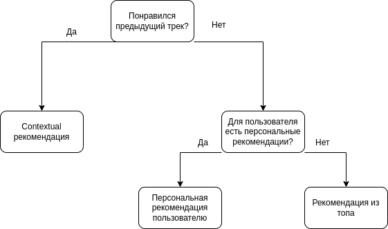
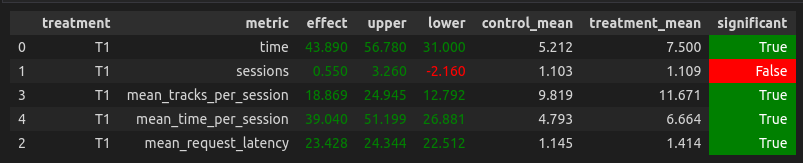

# ОТЧЕТ

## Abstract: основная идея эксперимента

**Начальное предположение**: contextual рекомендер строит рекомендации только на основании прослушанных треков в сессии, при этом он никак не учитывает личные предпочтения пользователя.

**Идея для реализации**: давайте изначально строить рекомендации пользователю с помощью Contextual рекомендера, а если такие рекомендации ему не нравятся — пробуем предложить ему что-то 
из персональных рекомендаций. Если это “инкогнито” пользователь — попробуем разнообразить его выдачу треками из топа. Таким образом мы получаем и session-based и user-based рекомендации. 
Чтоб пользователю было еще приятнее — запомним уже прослушанные треки и не будем их рекомендовать.


## Детали: минимум того, что нужно знать, чтобы разобраться в реализации
Получение более актуальных данных:
* обучила lightFM на большом количестве данных 
  * сохранила рекомендации для каждого пользователя в файл [recommendations_new.json](/botify/data/recommendations_new.json)
* получила top популярных треков из большого набора данных

Новый рекомендер [ContextualIndexed](/botify/botify/recommenders/contextual_with_indexed.py) написан на основе Contextual, Indexed и TopPop рекомендеров. 
Добавлена история треков, прослушанных пользователем во время сессии.

Вот суть нового рекомендера:



3. Результаты A/B эксперимента 



такой результат получился при использовании данных после запуска эксперимента со следующей конфигурацией:

```python sim/run.py --episodes 1000 --config config/env.yml single --recommender remote --seed 31337```

Полученный рекомендер "бьет" Contextual. Наиболее вероятно, что качество бы выросло больше, 
если бы для каждого пользователя мы сохраняли не просто топ k треков для него, 
а только те треки, для которых prediction>treshhold. 
Предположение основано на мысли, что LightFM смог распознать мало релевантных пользователю треков, и в top k для пользователя
 "затерялись" треки с низким для него рейтингом.


